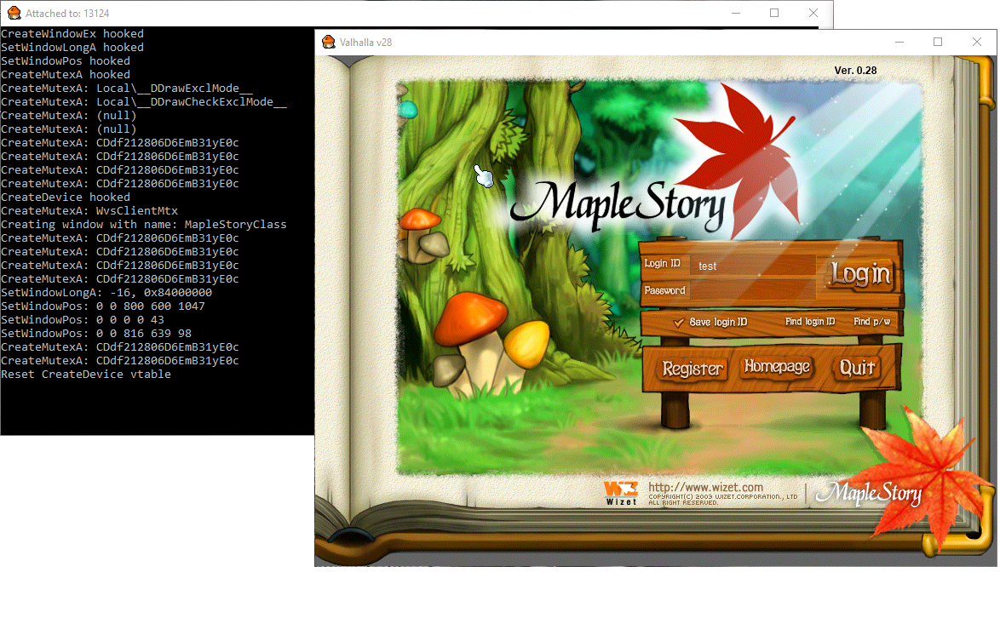

# MapleStory Client Hook

Example way of hooking functions in early version of MapleStory. Only tested with veresion v28. 

## How to build

Make sure visual studio is installed and edit the `VSTOOLS` variable in `build.bat` to point to your installed version of `vcvars32.bat`. Make sure you point to the 32-bit version.

Download and install the DirectX SDK 2006 and make sure the `INCLUDE_DIR` and `LIB_DIR` variables in `build.bat` are pointing to your install.

Download the Microsoft Detours repo and compile the x86 lib and copy the compiled lib and header file into this directory.

Running `build.bat` should compile the DLL.

## How to inject

Once DLL has been compiled use a tool such as CFF explorer to add the DLL to the ijl15.dll import table.

## Config

Make sure the ini file suplied is placed in the same folder as your MapleStory exe.

```
[Debug]
print = 1 ; console is created with debug statements
multiclient = 1 ; allows multiple clients to be open at the same time

[Display]
window_mode = 1
resolution_x = 800
resolution_y = 600
screen_centre = 1 ; Show the window in the centre of the screen when created
```

## Screenshot

